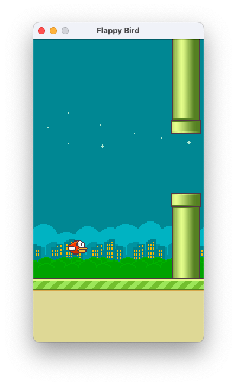

# Домашнее задание № 4 - Игра в Flappy Bird

------------


# Задание

------------
Ваша задача состоит в создании агента для игры в окружении Flappy Bird. 

Запуск окружения в ручном режиме приведен через команду
```docker
python3 app.py
```

Управление через стрелка-верх и пробел. Выход из приложения - esc.
В случае проигрыша среда перезапускается заново. 

## Чем можно управлять
- Действие (прыгать или не прыгать)
- Скорость прыжка (опционально)*
- Скорость окружения (опционально)*
- Скорость поворота игрока (опционально)*

*Изменение параметров, а также любое усложнение игры будет положительно влиять на оценку задания. 

## Минимальные требования
- Набрать не менее 100 очков за одну сессию. Сессией считается от момента старта игры до поражения (врезание в 
препятствие)
- Сессия с более, чем 100 очками, должна быть получена хотя бы с параметрами окружения по-умолчанию 
(уже заданы в репозитории). 


# Окружение

------------
Необходимы библиотеки приведены в ``requirements.txt``
```bash
pip3 install -U -r requirements.txt
```
